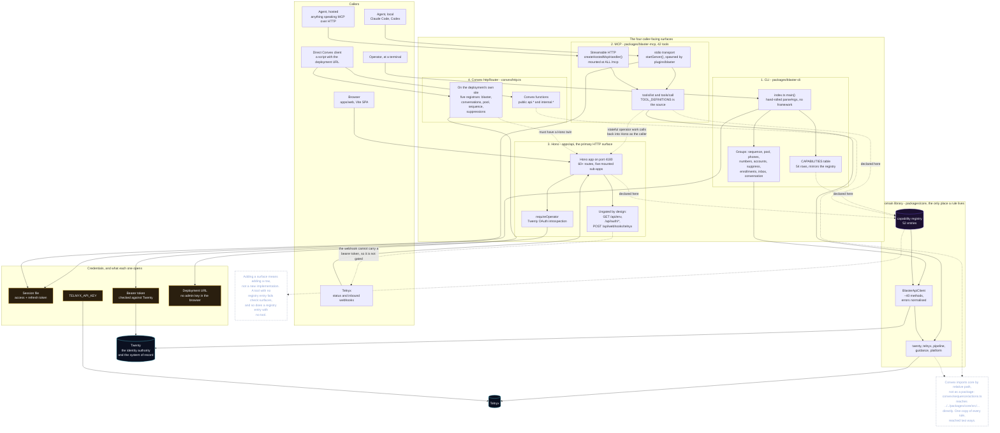
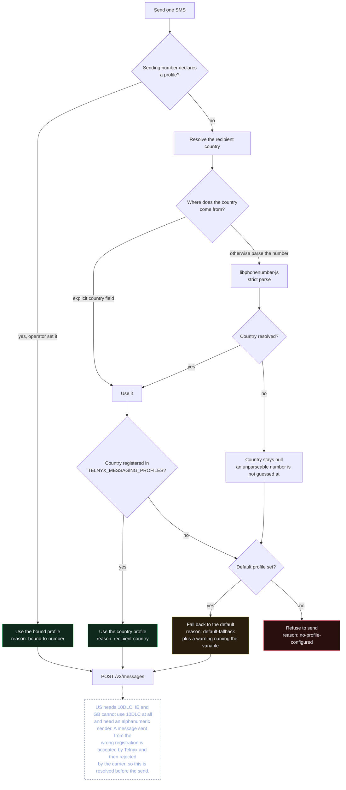
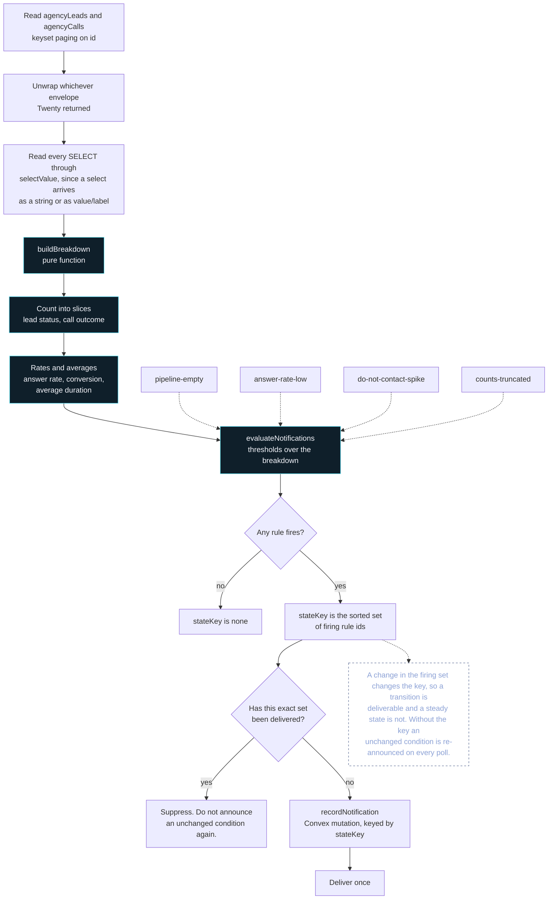

<p align="center">
  
</p>

# Blaster

Blaster reads a Twenty CRM workspace, reports what the pipeline actually looks
like, and sends SMS through the Telnyx messaging profile registered for the
recipient's country. It is internally deployed software on `railcode.dev`.

An operator or an agent reaches it four ways: a CLI, an MCP server over two
transports, the Hono HTTP API, and Convex's own HTTP router. Only one rule lives
in any of them — `packages/core`. The diagram below is the whole entry surface,
including which routes deliberately skip the operator gate; read
[docs/diagrams/entrypoints-and-transports.mmd](docs/diagrams/entrypoints-and-transports.mmd)
before adding a command, a tool, or a route.



## What it does

- **Reads Twenty.** Leads, calls, and prospects come from the Twenty workspace
  over its REST API, with keyset pagination and tolerant response unwrapping.
- **Reports the pipeline.** A breakdown of lead status, call outcomes, answer
  rate, and conversion, plus the notifications those numbers currently trigger.
- **Sends SMS on the right profile.** Country detection goes through a phone
  number library, and the messaging profile is chosen from the recipient's
  jurisdiction before the send.
- **Finds prospects with treg.** Discovery runs through the treg Convex
  component, with a per-call cost ceiling and a spend ledger.

## Why the messaging profile matters

A Telnyx messaging profile is a registration, not a preference. US recipients
need a 10DLC brand and campaign. Ireland and the UK cannot use 10DLC at all and
need a profile carrying an alphanumeric sender.

Sending an Irish number from a US profile is accepted by Telnyx and then rejected
by the carrier. So Blaster resolves the profile from the recipient *before* the
send, and when a country has no registered profile it falls back to the default
and returns a warning naming the variable to set. Adding a country is a
configuration change, never a code change:

```bash
TELNYX_MESSAGING_PROFILES=US=<id>,IE=<id>,GB=<id>,DE=<id>
```

## The three surfaces

| Surface | Command | What it is |
| --- | --- | --- |
| CLI | `blaster` | The `blaster` binary, for scripting and one-off work |
| MCP | `blaster-mcp` | Stdio MCP server on `@modelcontextprotocol/server` 2.x |
| HTTP | `apps/api` | A Hono worker, the request surface for the Railcode app |

All three read the same domain code, so an answer cannot differ between them.

```bash
blaster breakdown                       # counts, rates, firing notifications
blaster env                             # every variable and whether it is set
blaster profile --to +353871234567     # which profile a recipient resolves to
blaster prospects agencyLeads --json    # records straight from Twenty
blaster capabilities                    # every capability and its surfaces
blaster send --to <to> --from <from> --text <text>
blaster numbers search --country IE     # available Telnyx inventory
blaster numbers buy --number +353871234567
blaster numbers owned
blaster numbers attach --number +12155550101 --state PA --pool <id>   # account, state, profile, pool; prints what it still needs
blaster phones list
blaster inbox list --person             # one row per person, pool numbers folded
blaster inbox show <conversation-id>
blaster sequence validate               # piped JSON draft
blaster sequence enroll <seq-id> --filters '<json>'
blaster pool                            # interactive wizard (Clack prompts)
blaster pools create --name "Ireland outbound"
blaster pools add-number --pool <id> --number +353871234567
blaster pools assign --sequence <seq-id> --pool <id>
blaster suppress list
blaster accounts list
blaster sequence status <sequence-id>      # watch a campaign: state, each prospect's place, every send
blaster sequence cancel <sequence-id>      # stop a campaign for good
blaster enrollments cancel|pause|resume <enrollment-id>
blaster accounts add acct-a --label "Main"
blaster suppress add --peer +353871234567 --reason "inbound STOP"
blaster login
```

```json
{
  "mcpServers": {
    "blaster": {
      "command": "blaster-mcp",
      "args": [],
      "env": {}
    }
  }
}
```

### Hosted MCP (the one entry point)

`https://blaster.listeningkit.com/mcp` serves every tool below over Streamable HTTP,
authenticated with your operator token (`blaster login`, then the token in
`.blaster/sessions.json`; never share or commit it). Each call runs as you.

```
claude mcp add --transport http blaster https://blaster.listeningkit.com/mcp \
  --header "Authorization: Bearer <operator token>"
```

ChatGPT and claude.ai connectors are not supported yet (they need an OAuth
authorization server with dynamic client registration; see
`docs/production-readiness.md`). The stdio server above is for local use.

MCP tools: `blaster_breakdown`, `blaster_env`, `blaster_messaging_profile`,
`blaster_send_message`, `blaster_list_records`, `blaster_search_numbers`,
`blaster_purchase_number`, `blaster_list_numbers`, `blaster_sync_phones`,
`blaster_validate_sequence`, `blaster_preview_sequence`,
`blaster_list_conversations`, `blaster_list_conversation_persons`,
`blaster_get_messages`, `blaster_list_pools`, `blaster_get_pool`,
`blaster_create_pool`, `blaster_add_pool_number`, `blaster_remove_pool_number`,
`blaster_reorder_pool`, `blaster_set_sequence_pool`,
`blaster_enroll_recipients`, `blaster_list_suppressions`,
`blaster_set_suppression`, `blaster_attach_number`, `blaster_list_accounts`,
`blaster_set_account`, `blaster_assign_number_account`, `blaster_cancel_sequence`,
`blaster_cancel_enrollment`, `blaster_pause_enrollment`, `blaster_resume_enrollment`,
`blaster_sequence_lifecycle`.

## What is inside

```
apps/api             Hono HTTP surface (the Railcode worker)
convex/              Convex backend: 15 tables over 7 domain files,
                     the httpRouter, the sequence cron, and two mounted
                     components (@convex-dev/agent, @convex-dev/rate-limiter)
packages/core        The domain. Every business rule lives here
  src/twenty/client        Twenty REST client, unwrapping, keyset paging
  src/telnyx/messaging     Profile resolution and the Telnyx client
  src/pipeline/breakdown   The breakdown builder and notification rules
  src/pipeline/sequence    The enrollment state machine and its rules
  src/guidance/prompts     The eight deterministic reply templates
  src/blaster/capabilities The capability registry, 52 entries
  src/platform/env         The environment manifest reader
packages/blaster-cli  The blaster binary
packages/blaster-mcp  The blaster-mcp server, 42 tools over two transports
plugins/blaster      Plugin manifest, MCP registration, five operator skills
config/env-vars.json  The environment contract every surface reads
docs/                Architecture, and the Mermaid sources in docs/diagrams/
scripts/             The pre-push gates
```

Each part, and why it exists:

- **`apps/api`** owns the request surface and nothing else. It resolves the
  dependency a route needs and delegates; anything that writes provider state is
  a Convex function, so there is exactly one owner of a write.
- **`convex/`** holds the database, the mounted `treg` and `telnyx` components,
  and the read-only HTTP routes a deployment can be inspected through.
- **`packages/core`** is the only place a business rule lives. The breakdown
  builder and the notification rules are pure functions, so they are tested with
  no workspace and no credentials.
- **`packages/blaster-cli`** and **`packages/blaster-mcp`** are thin shells over
  core. Neither holds logic, which is why they cannot disagree.
- **`config/env-vars.json`** is the contract. The API, the Convex backend, and
  the docs all read it, and a gate fails the build when a variable is declared
  but unread, read but undeclared, or marked planned without a reason.

## Setup

```bash
pnpm install
cp .env.example .env.local
```

Fill in `TWENTY_BASE_URL`, `TWENTY_API_KEY`, `TELNYX_API_KEY`, and
`TELNYX_MESSAGING_PROFILE_ID`. Add the country profiles you have registered.
`blaster env` tells you exactly what is still missing, and which countries have
no profile.

```bash
pnpm dev                # the Hono API on :4180
pnpm convex:dev         # a local Convex deployment
pnpm test               # the pure logic, no credentials needed
pnpm run check          # every gate
```

## Deployment

Blaster deploys to `railcode.dev` as a private app. `railcode.json` points at
the Hono worker and `manifest.yaml` scopes the `twenty` connector, so the worker
reads Twenty through the platform rather than carrying a long-lived API key.
The Railcode CLI builds the worker; there is no bundler config in the repo.

Convex functions deploy separately with `pnpm convex:deploy`.

## Gates

`lefthook.yml` runs these before every push, in this order:

| Gate | Enforces |
| --- | --- |
| `check:secrets` | no credential is committed |
| `check:secrets:self-test` | the scanner still separates known-bad from known-good fixtures |
| `check:goal` | `goal.md` is a current outline (updated within 20 min) |
| `check:naming` | the `{library}/{domainname}/helpers` convention |
| `check:convex` | backend structure: kebab-case, domain `index.ts`, named exports |
| `check:surfaces` | the capability registry, MCP tools, and HTTP routes agree |
| `check:env` | the manifest and the code agree, in both directions |
| `check:no-emoji` | no emoji anywhere in the repository |
| `check:no-font-mono` | forbids any fixed-width font from rendering |
| `check:encoding` | no mojibake introduced by editor or tool drift |
| `typecheck` | all four packages, strict |
| `lint` | Convex lint (after typecheck, since two rules need type information) |
| `test` | the pure logic plus the `convex/test` integration harness |

The secret scan runs first because a credential leak is the worst outcome
available and the only failure no later gate would catch.

### What the secret gate does

It scans `git ls-files`, so it reads **exactly what would be pushed** and nothing
else. That matters twice: the 845 vendored documentation files stay out of scope
automatically, because they legitimately contain example keys in code samples,
and a file that is only in your working tree cannot be reported as a leak.

It checks three things:

1. **No forbidden file is tracked.** Every `.env.<suffix>` is forbidden except
   `.env.example`, `.env.template`, and `.env.sample`, matched on the basename so
   a nested `apps/api/.env.local` is caught too. So are private keys, credential
   JSON, and `temp_login.json`.
2. **No known provider credential shape.** Telnyx API keys and webhook tokens,
   Clerk keys, JWTs (which is what a Twenty API key is), AWS and GitHub tokens,
   Slack tokens, Stripe live keys, and database URLs carrying a password.
3. **No plausible secret assigned to a credential-shaped name**, unless the value
   is an obvious placeholder.

Findings are redacted in the log, as `KEY0…0p`, never the whole value.

The third rule leans on a placeholder allowlist rather than a secret allowlist, so
a genuinely new credential is caught by default and a false positive has to be
argued for explicitly.

### Why the scanner has its own self-test

`pnpm run check:secrets:self-test` writes known-bad and known-good fixtures to a
temporary directory and checks the scanner separates them, so the gate is not
trusted on trust. It has already earned its place: the first version allowed any
bare `[a-z0-9-]` value as a placeholder, which also matches a hex API key, so a
real credential of that shape passed. The self-test caught it.

## Sequence builder

A sequence is a sending number, a campaign, a set of options, and an ordered
list of steps. Build it, dry-run it, then turn it on.

```bash
# Check a draft and get every problem at once
echo '{"name":"Spring outreach","fromNumber":"+353871234567",
       "campaignId":"cmp_123",
       "options":{"dailyCapPerRecipient":2},
       "steps":[{"text":"Hi, noticed your work in Cork.","delayHours":0,"isStop":false},
                {"text":"Following up in two days.","delayHours":48,"isStop":false},
                {"text":"","delayHours":96,"isStop":true}]}' \
  | blaster sequence validate
# Valid. 2 sending step(s) across 48h, with a stop condition.
```

Dry runs need no Telnyx credentials, because they send nothing:

```bash
echo "$DRAFT" | blaster sequence preview --recipients '[
  {"id":"p-ie","to":"+353871234567","country":"IE"},
  {"id":"p-us","to":"+14155552671","country":"US"},
  {"id":"p-de","to":"+4915112345678","country":"DE"},
  {"id":"p-dnc","to":"+353871234568","country":"IE","doNotContact":true}]'
# 2 of 4 recipient(s) would receive the next step.
#   [send] p-ie    profile-ie-alpha
#   [send] p-us    profile-us-10dlc
#   [skip] p-de    no-profile-for-country
#   [skip] p-dnc   do-not-contact
```

Drafts are also recorded locally, so a sequence can be built once and reused:

```bash
blaster sequence new "Spring outreach"   # interactive build, then recorded
blaster sequence list                    # what is recorded
blaster sequence show "Spring outreach"  # steps plus a per-recipient plan
blaster sequence edit "Spring outreach"  # change the first message
blaster sequence run "Spring outreach"   # dry run against the recorded draft
blaster sequence rm "Spring outreach"    # forget it
```

Unfinished builder drafts and committed sequences live directly in Convex.
`run` is a dry run over the recorded draft: it prints the compliance plan and
names what the runner still needs. See [docs/sequencer.md](docs/sequencer.md)
for what is finished, what is not, and the exact gaps.

The same operations are on all three surfaces:

| Surface | Validate | Dry run |
| --- | --- | --- |
| CLI | `blaster sequence validate` | `blaster sequence preview` |
| MCP | `blaster_validate_sequence` | `blaster_preview_sequence` |
| HTTP | `POST /api/sequences/validate` | `POST /api/sequences/preview` |

### Options

| Option | Default | What it does |
| --- | --- | --- |
| `stopOnReply` | `true` | Stops the sequence as soon as the recipient replies |
| `respectDoNotContact` | `true` | Never sends to an opted-out prospect |
| `requireProfileForCountry` | `true` | Skips a recipient whose country has no registered profile, instead of sending from the default and letting the carrier reject it |
| `dailyCapPerRecipient` | `0` | Ceiling on messages per recipient per day. `0` means no cap |

### Why eligibility is checked twice

Once in the dry run, so an operator sees who is skipped before turning anything
on, and again at send time, because a recipient can opt out between the two. The
send-time check is the one that counts; the dry run is a preview of it.

A skip never advances the cursor. The step is still owed and the reason is
recorded, so an operator can either fix the cause or pause the sequence rather
than silently losing the message.

See [docs/diagrams/sequence-builder.mmd](docs/diagrams/sequence-builder.mmd).

## Number pools

A pool is an ordered group of sending numbers worked one at a time, each inside
its own rate budget. Assign a pool to a sequence and the pool, not a fixed
`fromNumber`, decides which number sends each message:

```bash
blaster pool                                 # interactive: build a pool, pick numbers, assign it
blaster pools create --name "Ireland outbound"
blaster pools add-number --pool <id> --number +353871234567
blaster pools add-number --pool <id> --number +353871234568
blaster pools assign --sequence <sequence-id> --pool <id>
```

`blaster pool` is the interactive entry point (Clack prompts, behind the login
gate): name the pool, pick its numbers from the workspace's sendable numbers,
then optionally assign it to a sequence. The `blaster pools ...` flags are the
same operations for scripts.

When no number may send now the runner defers to the instant the pool is next
able to send, rather than pushing the message into the carrier's limit queue.
The number's budget is spent only once the step is claimed. Removing a number is
a soft removal, so an in-flight send still resolves. The tables, the selection
rule, the status fields, and the surfaces are in [docs/pools.md](docs/pools.md).

## Authentication is checked before any command does work

**Rule: no command may read a credential it has not authenticated. The only
exemptions are the commands that print their own help.**

This is not a style preference. A stored access token expires on its own, and the
failure mode of ignoring that is specific and nasty: the command sends the stale
token, the API rejects it, and the operator is told they are signed out while
sitting in front of a working session with a valid refresh token in
`.blaster/sessions.json`. That is not a hypothetical — `blaster inbox` and
`blaster sequence` both shipped exactly that bug.

### The three tiers

| Tier | Commands | What must be true before any work happens |
| --- | --- | --- |
| **Operator session** | `send`, `inbox list`, `inbox show`, `sequence` | A session exists for a configured API **and `ensureLiveSession(root, apiUrl)` returned one**. Never read `home.sessions[apiUrl].accessToken` directly. |
| **Service credential** | `breakdown`, `prospects`, `numbers *`, `phones *`, `conversation *` | `twentyOrFail()` has confirmed `TWENTY_BASE_URL` and `TWENTY_API_KEY` are present. These do not use the operator session and must not pretend to. |
| **No credential** | `help`, `--help`, `capabilities`, `login`, `logout`, `whoami`, and any subcommand's usage text | Nothing. These must keep working when signed out, or an operator cannot find out how to sign in. |

`login`, `logout`, and `whoami` are exempt because they *are* the authentication
surface: `whoami` has to be able to report that there is no session, and `logout`
has to be able to remove one.

### What "checked" means

1. **Resolve, then use.** Call `ensureLiveSession` (or `twentyOrFail`) and use
   what it returns. Reading a credential out of storage and handing it to a
   client is the bug this rule exists to prevent.
2. **Refresh, don't reject.** `ensureLiveSession` validates a live token and
   renews an expired one from the stored refresh token, persisting the result. A
   recoverable session must never present as a signed-out operator.
3. **Offer the sign-in when there is somewhere to sign in to.** When an API URL
   is configured but no live session can be produced, an interactive command
   offers `loginMain` rather than only printing an error. With no API URL
   configured at all there is nowhere to sign in to, so say that instead.
4. **Fail closed, with the exit code intact.** An authentication failure returns
   non-zero and writes nothing. A submenu or wrapper must not swallow that code
   and exit 0 — a scripted caller would see success for a run that did nothing.
5. **Resolve once per command.** Cache the resolved client on the command
   context. An up-front check and a later lookup should not each pay for the same
   validation round trip.

### Where the check happens

At the **start** of the command, before the first prompt. An interactive command
that needs a session resolves it before asking anything, so an operator finds out
they are signed out immediately rather than after typing a name into a wizard.
The scripted paths (`--from`, `--json`, explicit flags) must still work without a
session where they never needed one: recording a local draft touches no account.

See `ensureLiveSession` in `packages/blaster-cli/src/cli/login.ts`, and
`liveClient` in `packages/blaster-cli/src/cli/sequence.ts` for the resolved-once
pattern.

## Documentation

- [docs/README.md](docs/README.md) — authored versus vendored, and the
  suite-to-library map for the 845 files of upstream docs on disk
- [docs/architecture.md](docs/architecture.md) — how the two runtimes split, the
  Twenty sharp edges, and the profile rules
- [docs/naming-conventions.md](docs/naming-conventions.md) — the required
  directory structure
- [docs/diagrams/](docs/diagrams/) — fourteen Mermaid diagrams covering the
  entry points and transports, the system overview, profile resolution, the
  breakdown and notification flow, the data model, the send sequence, the
  sequence builder, the enrollment state machine, one tick of the runner, the
  reply prompts, Twenty auth paths, deployment, and the gates
- [docs/sequencer.md](docs/sequencer.md) — the multi-step sequencer: what is
  finished, what is not, and the exact gaps before a draft can run itself
- [docs/production-readiness.md](docs/production-readiness.md) — what has been
  proven against a live carrier, and what has not

## Diagrams

Every diagram below is a verbatim copy of its source in
[docs/diagrams/](docs/diagrams/), and `pnpm check:diagrams` fails the push if a
copy drifts from its source or if a fact a diagram asserts stops being true. The
full set, and which ones to read first, are indexed there.

**Profile resolution, which happens before every send:**



**From Twenty rows to a notification that is delivered once:**



