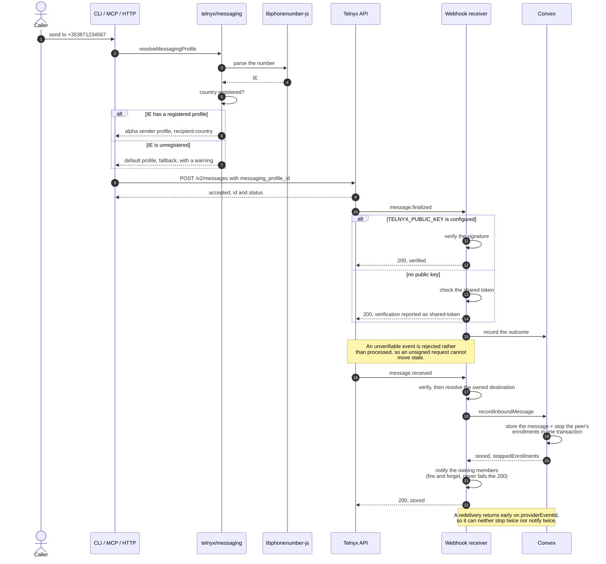

# Blaster architecture

Blaster reads a Twenty CRM workspace, reports what the pipeline looks like, and
sends SMS through the messaging profile registered for the recipient's country.

## Shape

<!-- embedded: system-overview.mmd -->
The whole system in one picture. Every rule below this diagram lives in `packages/core`, and every surface is a caller of it.

```mermaid
flowchart TB
  subgraph clients["Clients"]
    CLI["blaster CLI<br/>packages/blaster-cli"]
    MCP["blaster-mcp<br/>stdio, and Streamable HTTP at /mcp"]
    WEBAPP["blaster web<br/>apps/web, Vite SPA"]
    CALLER["HTTP callers"]
  end

  subgraph api["Request surface - apps/api, Hono"]
    HONO["Hono worker<br/>railcode.json names it as the server"]
    OAUTH["requireOperator<br/>Twenty OAuth introspection"]
  end

  subgraph core["Domain library - packages/core, the only place a rule lives"]
    CLIENT["twenty/client<br/>REST client, envelope unwrapping,<br/>keyset pagination"]
    MSG["telnyx/messaging<br/>profile resolution, Telnyx client"]
    BRK["pipeline/breakdown<br/>pure builder, notification rules"]
    COMPLY["pipeline/sequence/compliance<br/>checkSenderReadiness, checkStateMatch"]
    POOL["pipeline/pool<br/>pure selection and cursor math"]
    ENV["platform/env<br/>manifest reader"]
  end

  subgraph convex["Convex backend - Convex Cloud"]
    SCHEMA["schema.ts composes 7 domain files<br/>15 tables, see data-model.mmd"]
    HTTP["convex/http/<br/>operator routes mirrored, so a site<br/>with no Hono still answers"]
    SEQACT["convex/sequence/actions.ts<br/>runDueEnrollments, runEnrollmentStep,<br/>enrollRecipients"]
    CRON["convex/crons.ts<br/>sequence runner, 15s, limit 25"]
    RL["convex/rateLimit.ts<br/>account, per-number, campaign, brand"]
    PHONES["convex/phoneNumbers/<br/>ledger, compliance snapshot"]
    AGENT["@convex-dev/agent<br/>conversation threads and history"]
    LIMITER["@convex-dev/rate-limiter<br/>mounted component"]
  end

  subgraph external["External providers"]
    TWENTY[("Twenty CRM<br/>REST /rest/object<br/>GraphQL /graphql")]
    TELNYX["Telnyx API<br/>/v2/messages<br/>/v2/messaging_profiles"]
  end

  MANIFEST[("config/env-vars.json<br/>the environment contract")]
  SECRET[(".env.local<br/>gitignored, values only")]

  CLI --> core
  MCP --> core
  WEBAPP --> HONO
  CALLER --> HONO
  HONO --> OAUTH
  HONO --> core
  HONO -. "writes" .-> convex

  CLIENT --> TWENTY
  MSG --> TELNYX
  BRK --> CLIENT
  ENV --> MANIFEST
  COMPLY --> PHONES

  SEQACT --> core
  SEQACT --> PHONES
  SEQACT --> AGENT
  CRON --> SEQACT
  SEQACT --> RL
  RL --> LIMITER
  HTTP --> SCHEMA
  HTTP --> SEQACT

  MANIFEST -. "read by" .-> core
  MANIFEST -. "read by" .-> convex
  SECRET -. "values for" .-> MANIFEST

  NOTE["The runner is only alive because crons.ts schedules it.<br/>Without that one line, runDueEnrollments exists,<br/>is correct, and is read by nobody."]:::note
  CRON -.-> NOTE

  classDef note fill:none,stroke:#5f6f96,stroke-dasharray:4 4,color:#8ea3d6
  classDef store fill:#1b1030,stroke:#7c5cff,color:#f5f7ff
  classDef ext fill:#0b1020,stroke:#5ee7ff,color:#f5f7ff
  classDef sched fill:#2a1f0f,stroke:#fbbf24,color:#f5f7ff
  class TWENTY,TELNYX ext
  class MANIFEST,SECRET store
  class CRON sched
```




Two runtimes, one contract.

```
apps/api        Hono HTTP surface (the request layer)
convex/         Convex backend: schema, components, functions
packages/core   Shared domain logic, the only place business rules live
config/         The environment manifest, read by every surface
docs/           This documentation
```

The split is deliberate. A request arrives at Hono, which resolves the
dependency it needs and delegates. Anything that writes provider state is a
Convex function rather than a route, so there is exactly one owner of a write
and the two runtimes cannot disagree about it.

The full picture, including the mounted components and the two external
providers, is in [diagrams/system-overview.mmd](diagrams/system-overview.mmd).

## Why Hono and Convex together

Convex already owns the database, scheduling, and the two mounted components
(treg and telnyx). What Convex does not give you is a small, fast HTTP surface
with an honest request model, and that is what Hono is good at. Running both
means the read path is plain fetch and the write path is a transaction.

Convex is optional at runtime: with no `CONVEX_URL` configured the API answers
from Twenty directly. That keeps the service startable and testable before a
deployment exists, rather than failing closed on a missing backend.

## Packages and the naming convention

`packages/core` follows the `{library}/{domainname}/helpers` convention, which
`scripts/check-naming-conventions.mjs` enforces:

```
packages/core/src/
  twenty/client/          Twenty REST client, envelope unwrapping, keyset paging,
                          and the actor a write is attributed to
  twenty/actor/           The Actor Twenty stamps on a record; resolves a member
                          to a `createdBy` (Twenty's own field name)
  twenty/workspaceMember/ Reading `workspaceMembers` to attribute a write to a person
  twenty/agencyPhone/     agencyPhones mapping and Twenty/Convex sync planning
  twenty/agencyProspect/  agencyProspects: the filter menu, validation, and batch eligibility
  twenty/agencyCall/      agencyCalls: the call record, the Telnyx event mapping,
                          and the schema provisioner
  twenty/objectService/   Twenty's object metadata (`/metadata`); mirrors Twenty's own name
  twenty/oauth/           Twenty OAuth2 (discovery, PKCE, token exchange/refresh, introspection)
  twenty/graphql/         Session-bound GraphQL client (OAuth tokens with refresh);
                          reads the generated client emitted by `pnpm twenty:client`
  ai/analysis/            Grading a call transcript with an OpenAI-compatible provider
  telnyx/messaging/       Profile resolution, webhook verification, and the Telnyx REST client
  telnyx/numbers/         Number search, purchase, and messaging-profile assignment
  pipeline/breakdown/     The breakdown builder and the notification rules
  pipeline/sequence/      Sequence drafts, eligibility, and enrollment cursors
  pipeline/pool/          Number-pool selection and per-number rate limits
  conversation/classification/  Per-message states, Jev questions, reply gate
  guidance/prompts/       Versioned reply guidance selected by resolution path
  platform/env/           The environment manifest reader
```

The typed GraphQL client is generated from the live workspace
(`scripts/emit-twenty-client.mjs`, `pnpm twenty:client`), following the
twenty-coach pattern: introspect the instance, emit
`twenty/graphql/generated/`, expose it at the
`@blaster/core/twenty/graphql/generated` subpath. Until generation, transports
keep working as before — generation swaps internals, not call sites.

Two credentials reach Twenty, and they are not interchangeable. Record reads and
writes use `TWENTY_API_KEY`; object metadata on `/metadata` rejects that key
outright and needs an OAuth bearer. See `twenty/objectService` and
`twenty/agencyCall/schema.ts`.

Writes carry an actor. Blaster authenticates as the *workspace*, so without one
Twenty stamps every record with its anonymous API actor. `twenty/actor` resolves
the signed-in operator to a `workspaceMember` and passes that as `createdBy`.
Attribution is best-effort: a surface with no signed-in operator still writes, it
just is not attributed. See docs/member-attribution.md.

Every domain has an `index.ts` entrypoint, every `helpers/` has a barrel, and no
helper imports its own domain barrel. Callers import the domain, never the
helper file, so the internal shape can change without touching call sites. See
[docs/naming-conventions.md](naming-conventions.md).

## The data flow

<!-- embedded: send-message-sequence.mmd -->
One message, end to end, including the branch where the outcome is honestly unknown.




1. `GET /api/breakdown` reads `agencyLeads` and `agencyCalls` from Twenty.
2. `buildBreakdown` counts them into slices. It is pure, so it is tested with
   no workspace and no credentials.
3. `evaluateNotifications` turns the breakdown into the notifications that
   currently fire, and a state key identifies the firing set.
4. A poller that sees the same state key twice knows not to re-announce.

The split between step 2 and step 3 is what makes the notification logic
testable. The rules are thresholds over a value, not code that reaches out to a
provider. See
[diagrams/breakdown-and-notifications.mmd](diagrams/breakdown-and-notifications.mmd).

## Twenty integration

Three properties of the real workspace shape this client, and each is handled
explicitly rather than assumed away:

- **Cursors are ignored.** `startingAfter`, `offset`, and `page` all return page
  one, so paging walks `id` ascending with `orderBy=id[AscNullsFirst]` and
  `filter=id[gt]:"<last id>"`. The cursor replaces the caller's filter, so a
  filtered walk combines them itself.
- **The envelope varies.** The same list endpoint has returned a bare array,
  `{data:{<plural>}}`, `{data:{data:{<plural>}}}`, `rows`, and GraphQL
  `edges[].node`. `unwrapList` accepts all of them.
- **`SELECT` fields are ambiguous.** A select arrives as a bare string or as
  `{value,label}` depending on how it was written, so every read goes through
  `selectValue`.

Record reads still use REST, and the reason is behavioural rather than a
limitation of GraphQL. The custom `agency*` objects *are* in the core GraphQL
schema: the generated client in `packages/core/src/twenty/graphql/generated/` is
built from live introspection and contains `agencyPhones`, `agencyLeads`,
`agencyCalls`, and the rest, with exact field types. REST stays for now because
the reads depend on behaviour the GraphQL connections do not offer the same way
— the keyset walk over `id`, and the several envelope shapes the endpoints have
returned over time. Migrating them is a change of transport, not of
capability, and the typed client is the destination when it happens.

## Messaging profiles

A Telnyx messaging profile is a registration, not a preference. US recipients
need a 10DLC brand and campaign; IE and GB recipients cannot use 10DLC at all and
need an alphanumeric sender. Sending an Irish number from a US profile is
rejected by the carrier after Telnyx has already accepted it, so the profile is
resolved from the recipient before the send.

Resolution order, most specific first:

1. the profile bound to the sending number, when the operator set one
2. the country profile for the recipient, US then IE/GB
3. the default profile

A country with no dedicated profile falls back to the default and returns a
warning naming the variable to set. That is a deployment gap, and the response
says so instead of hiding it.

Which countries have a profile is configuration, not code: see
[diagrams/messaging-profile-resolution.mmd](diagrams/messaging-profile-resolution.mmd)
for the full decision, and
[diagrams/send-message-sequence.mmd](diagrams/send-message-sequence.mmd) for one
message end to end including the inbound webhook.

A batch send to a filtered set of prospects is the same rule applied to many
recipients at once: the pool comes from `agencyProspects`, eligibility is split
before anything is sent, and every recipient gets its own outcome. The full
intent, the four routes, and the response shape are in
[send.md](send.md), with
[diagrams/prospect-batch-send.mmd](diagrams/prospect-batch-send.mmd) for the run.

## Components

| Component | Owns |
| --- | --- |
| `@listeningkit/treg` | Prospect discovery and enrichment, with a per-call cost ceiling and a spend ledger |
| `@listeningkit/telnyx` | Inbound webhook signature verification and messaging profile state |
| `@agentmail/convex` | Inbound email events |

Components rather than hand-rolled clients, so provider state lives in the
database, survives a redeploy, and stays queryable.

## Environment

`config/env-vars.json` is the contract. The API, the Convex backend, and the
docs all read it rather than keeping their own lists, so a variable that no
surface consumes is a drift the manifest makes visible. `GET /api/env` reports
each variable with its configured state and which module consumes it, and names
the countries with no messaging profile configured.

## Gates

| Gate | Enforces |
| --- | --- |
| `check:secrets` | no credential is committed |
| `check:secrets:self-test` | the scanner still separates known-bad from known-good |
| `check:goal` | `goal.md` is a current outline (updated within 20 min) |
| `check:naming` | the `{library}/{domainname}/helpers` convention |
| `check:convex` | the Convex tree's own naming, barrels, and internal-call rules |
| `check:surfaces` | the CLI capability registry, the MCP tools, the HTTP routes, and README.md all agree |
| `check:env` | every manifest variable is consumed by a real file |
| `check:generated` | `convex/_generated/api.d.ts` and `server.d.ts` match the local tree |
| `check:generated-client` | the committed Twenty GraphQL client is current |
| `check:twenty-objects` | the Twenty object allowlist is current |
| `check:no-emoji` | no emoji anywhere in the repository |
| `check:no-font-mono` | forbids any fixed-width font from rendering |
| `check:encoding` | no mojibake in tracked text |
| `typecheck` | all four packages, strict |
| `lint` | Convex lint (after typecheck, since two rules need type information) |
| `test` | the pure logic plus the `convex/test` integration harness |

`twenty:client:check` is separate from that list because it needs either
instance credentials or a saved schema: it regenerates the Twenty client and
fails when the committed tree is stale, so schema drift is caught on the next
regeneration rather than silently at runtime.
