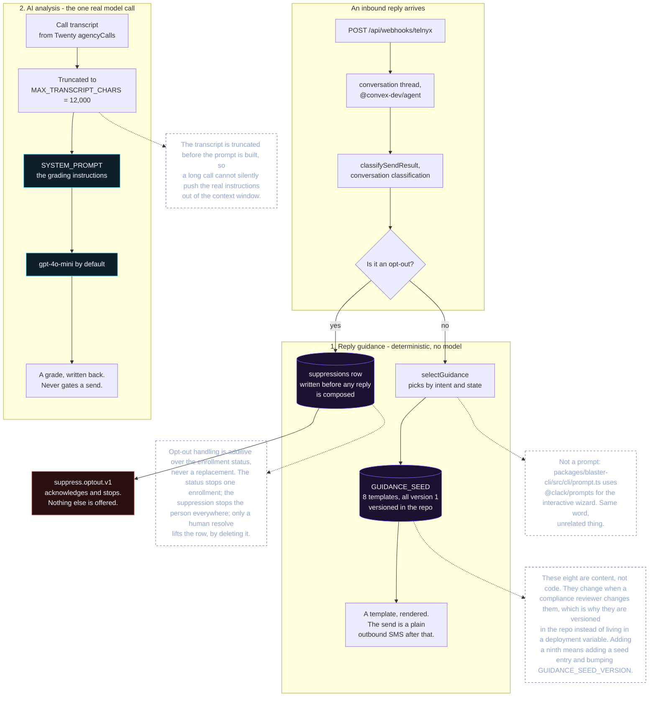

# Call history

`agencyCalls` is the call record: one row per call, holding the recording, the
transcript, and the AI grading of it. Twenty is where an operator reads it, so
the object is provisioned into the workspace rather than kept only in Convex.

## Events

Three Telnyx events are handled, on the same receiver as messaging:

| Event | Effect |
| --- | --- |
| `call.recording.saved` | attach the recording, mark the transcript `PENDING` |
| `call.recording.transcription.saved` | attach the transcript, mark it `READY`, then analyse |
| `call.recording.error` | mark the transcription `FAILED` |

They arrive on the existing `POST /api/webhooks/telnyx`. They share that receiver
because they should: one signature check, one body, one place where an
unverified event is refused. **The call handlers are not a second webhook with
its own auth** — a separate token-gated receiver would accept exactly the events
the signed one refuses.

Matching an event to a row, in order of preference:

1. by `call_control_id` (`telnyxCallId` on the row);
2. by parties and recency, for a row left unstamped by a tab that closed before
   it could save the id — newest match wins, only rows with no recording, only
   inside a two-hour window;
3. otherwise create a row.

Creating is the last resort on purpose. A duplicate row and a missing row are
both wrong, but a duplicate is worse: an operator reading history cannot tell
them apart.

`direction` is read from the event and defaults to `UNKNOWN`. Telnyx does not put
it on every recording payload, and a wrong direction silently mis-files the call
in every report filtered by it. `UNKNOWN` is visible; `INBOUND` would be a guess.

## The relation trap

This is the part that costs an afternoon if you do not know it.

A Twenty relation is declared under its **base name** with type `RELATION`. The
REST write surface then addresses it as **`<name>Id`**. So the field is
`agencyPhone` and the write key is `agencyPhoneId`.

Declaring a TEXT field literally named `agencyPhoneId` — which is the obvious
thing to do when the write path uses that key — silently **shadows** the real
relation with a useless column holding an id string: no join, no cascade, and
nothing for Twenty's UI to render as a link. The write appears to work. The
relation does not exist.

`RELATION_FIELDS` in `twenty/agencyCall/helpers/schema.ts` therefore declares
`agencyPhone`, `agencyProspect`, and `agencyLead`, and `TEXT_FIELDS` contains
none of them nor their `Id` forms. There is a test that fails if that ever stops
being true.

Relations are created last, because a relation needs its target object to exist.
One whose target is absent is skipped and reported as neither new nor present,
rather than failing the run: the rest of the schema is still worth having.

## Provisioning

`setupCallHistorySchema()` in `twenty/agencyCall/schema.ts` creates the object and
its fields. It is separate from the record I/O in `index.ts` because the two have
different failure costs: provisioning runs once, deliberately, and mutates the
schema, while record I/O runs on every inbound webhook and must never be able to
change the shape of the object it writes to.

It is idempotent and safe to re-run. Every field is checked against the live
schema first, and a create that loses a race is caught by matching the "already
exists" error. That matters because Twenty phrases the same collision two ways —
`already exists` and `already used by another field` — and a setup that only
matches one of them throws on the second run of an otherwise fine migration.

Two more things about Twenty's metadata API, both load-bearing and both easy to
get wrong:

- **Object metadata lives on `/metadata`, not `/graphql`.** The root GraphQL
  Query has no `objects` field, so asking it is a guaranteed failure.
- **Option objects must be bare GraphQL literals.** Passing JSON — even valid
  JSON — fails on the backslashes, which is why a setup that works once fails on
  every re-run.

`/metadata` also **rejects `TWENTY_API_KEY`** ("Missing authentication token").
It needs an OAuth bearer, which is why provisioning takes its configuration as
arguments rather than reading the environment: the credential is not the one the
rest of the module uses.

## AI analysis

<!-- embedded: guidance-and-ai-prompts.mmd -->
The one real model call in this repo, and the eight templates that deliberately are not one.

When a transcript lands and `OPENAI_API_KEY` is set, `ai/analysis` grades it and
writes the result onto the same row — one row is one call, so the rating lives on
the record rather than in a side table.

The provider call is **not awaited by the webhook**. Telnyx needs a 2xx inside two
seconds, and the transcript is already stored by then, so waiting on an LLM to
acknowledge would risk a retry storm for no benefit. A failure is swallowed: an
analysis is an enrichment, and a provider outage must not turn a recorded call
into a failed webhook.

Any OpenAI-compatible `POST {base}/chat/completions` endpoint works, so this is
OpenAI by default and a gateway or local model by configuration. There is no SDK
because the only endpoint used is one POST of a two-message conversation.

The response is normalised rather than trusted. Every field is clamped and
defaulted on the way in, because a model asked for JSON will fence it, add
commentary, return numbers as strings, and invent a sentiment that is not in the
enum — and none of those should cost a call its analysis. A missing sub-score
falls back to the overall score mapped onto the 1-5 scale, not to a flat 3 that
would look like a considered answer.

Sentiment throughout is the **prospect's**, never the agent's. That is the point
of grading a call, and the prompt says so explicitly, because a model asked for
"sentiment" will otherwise answer about whoever spoke last.

## Degradation

| Situation | Result |
| --- | --- |
| `agencyCalls` not provisioned | `503`, reported in the response body |
| Twenty not configured | `503` |
| No `OPENAI_API_KEY` | transcript stored, not analysed |
| Provider fails | transcript stored, `ai*` fields absent |
| Event with no `call_control_id` | `200`, "unusable event" |
| No matching row for a transcript | `200`, "no matching call" |

The distinction that matters: a **configuration** problem answers `503`, because
an operator can fix it and a retry will not. An **event** problem answers `200`,
because Telnyx would otherwise burn its three attempts on something unfixable. A
genuine transient failure is not caught here and becomes a `500`, which is what
earns the retry.

Tests: `packages/core/test/agency-call.test.ts`,
`packages/core/test/ai-analysis.test.ts`,
`apps/api/test/telnyx-call-events.test.ts`.
