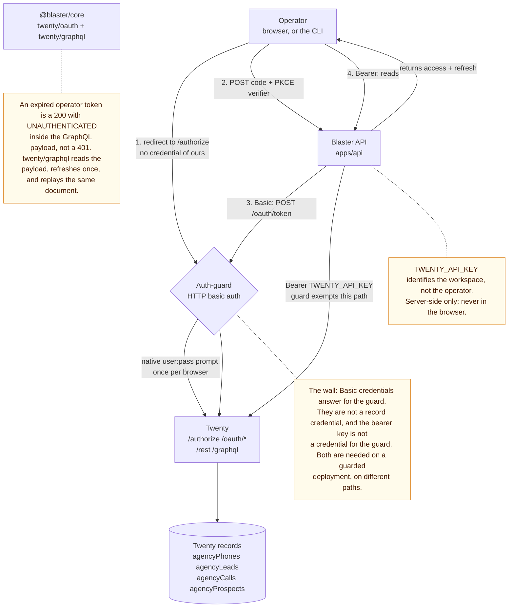

# Identity and the wall

Blaster has no password database and no sign-up form. **Twenty is the identity
provider**: the web app's sign-in button runs Twenty's own OAuth (PKCE) flow and
keeps the resulting token. The CLI does the same through the API. There is
exactly one credential a human ever supplies, and it is their Twenty workspace
account.

The complication is that a self-hosted Twenty is usually not reachable directly.
An **auth-guard** proxy sits in front of it and demands HTTP basic auth on every
path. That guard is "the wall", and passing it is the subject of this page.

## Two credentials, two jobs

<!-- embedded: twenty-auth-paths.mmd -->
The wall in front of Twenty, and which credential opens what.




| Credential | Carried as | Covers | Where it lives |
| --- | --- | --- | --- |
| `TWENTY_API_KEY` | `Authorization: Bearer` | `/rest/*` and `/graphql` — every record read and write | server only |
| `TWENTY_BASIC_USER` / `TWENTY_BASIC_PASSWORD` | `Authorization: Basic` | `/.well-known/*` and `/oauth/introspect` — the endpoints a guard commonly protects | server only |

The bearer token is the workspace's own key: it identifies the workspace, not
the operator, and it is what the record APIs require. The basic credentials
identify the guard, not the workspace, and a guard normally *exempts* `/rest`
and `/graphql` precisely so the record APIs work without them.

This is the part that confuses people. The bearer token does not get you past the
wall, and the basic credentials do not let you read records. A deployment with
both needs both, on different paths:

```
Operator browser  --Bearer-->  record APIs
Operator browser  --Basic---->  the wall, then Twenty's own sign-in
Blaster API       --Basic---->  discovery, introspection
Blaster API       --bare----->  /oauth/token and /oauth/register
Blaster API       --Bearer-->  record APIs (TWENTY_API_KEY)
```

## The wall must not cover the token endpoint

**This is the single most important thing on the page, and getting it wrong is
invisible.** An `Authorization: Basic` header reaching `/authorize` or
`/oauth/token` makes Twenty treat the caller as a *service* rather than a user.
It then issues an `APPLICATION_ACCESS` token whose `sub` is the application id
and whose `userId` / `userWorkspaceId` are placeholders that match no user row.
No human is left in the token, so:

- sign-in appears to work completely;
- `GET /api/auth/me` reports `active: true`;
- and **no record is ever attributed to a person** — every row shows the
  workspace's API actor.

Blaster's API therefore sends the guard's credentials to discovery and
introspection but never to the token endpoint
(`twenty/oauth/helpers/provider.ts`, and the test
`packages/core/test/twenty-public-pkce.test.ts`). On the proxy side, `/authorize`
and `/oauth/token` must be exempt from the gate *and* have the header stripped,
because a browser that has cached the wall's basic credentials will send them
without being asked:

```nginx
location = /authorize {
  proxy_pass http://127.0.0.1:3005;
  include /etc/nginx/proxy-params.conf;   # forwards Authorization $upstream_authorization
  proxy_set_header Authorization "";
}
location ^~ /oauth/token {
  proxy_pass http://127.0.0.1:3005;
  include /etc/nginx/proxy-params.conf;
  proxy_set_header Authorization "";
}
```

If sign-in starts failing with a 401 at `/oauth/token` after this change, the
exemption is missing. That is the intended failure: it is loud, unlike the bug it
replaces.
Operator browser  --Bearer-->  record APIs
Operator browser  --Basic---->  the wall, then Twenty's own sign-in
Blaster API       --Basic---->  discovery, token exchange, introspection
Blaster API       --Bearer-->  record APIs (TWENTY_API_KEY)
```

The same picture as a diagram: [diagrams/twenty-auth-paths.mmd](diagrams/twenty-auth-paths.mmd).

## The token flow, end to end

```
web app                        Blaster API                    Twenty (behind the guard)
   |                              |                                   |
   |-- GET /api/auth/config ----->|-- Basic: /.well-known/... --------->|
   |<-- {authorizationEndpoint,    |<-- {authorization_endpoint, ...} --|
   |     clientId, redirectUri,   |                                   |
   |     scope}                   |                                   |
   |                              |                                   |
   | save PKCE state + verifier in sessionStorage                     |
   |-- redirect /authorize?code_challenge=... ----------------------->|
   |                              |            native user:pass prompt (once)
   |                              |            email + password in Twenty's UI
   |                              |<-- operator clicks Authorize      |
   |<-- /callback?code=...&state=... ---------------------------------|
   |                              |                                   |
   |-- POST /api/auth/token ----->|-- POST /oauth/token ----------->|
   |<-- {tokens: access, refresh}  |<-- {access_token, refresh_token} -|
   |                              |                                   |
   |-- GET /api/auth/me --------->|-- Basic: POST /oauth/introspect -->|
   |<-- {active, memberResolved,  |<-- {active: true, ...} ----------|
   |     workspaceMemberId, ...}  |                                   |
```

| Route | Purpose |
| --- | --- |
| `GET /api/auth/config` | Public discovery for the SPA: authorize endpoint, client id, redirect URI, scope |
| `POST /api/auth/token` | Exchange `code` + PKCE `verifier` for Twenty tokens (server-side only) |
| `POST /api/auth/refresh` | Rotate a Twenty access token from a refresh token |
| `GET /api/auth/me` | Introspect a presented Bearer token and report the workspace member it resolved to |

`blaster login` drives the same flow from the terminal: it prints a URL, the
browser completes the round trip through `/login`, and the tokens are written to
the CLI's session file.

## Tokens, and where they live

| Token | Who holds it | Lifetime | Storage |
| --- | --- | --- | --- |
| PKCE `state` + `verifier` | browser | one sign-in | `sessionStorage` |
| Twenty `access` + `refresh` | browser, or the CLI | per Twenty's defaults | `sessionStorage` (cleared with the tab) or the CLI session file |
| `TWENTY_API_KEY` | Blaster API and Convex | per Twenty's key | server environment only |
| Guard basic credentials | Blaster API | per deployment | server environment only |

The client is a **public PKCE client**: registered with
`POST {TWENTY_BASE_URL}/oauth/register` and `token_endpoint_auth_method: none`,
so there is no secret to keep, rotate, or leak. `registerClient` ignores a
`client_secret` even if the instance returns one, so a deployment cannot drift
back into sending it. A confidential client (`client_secret_post`) is not a
stricter version of this — it is a different, broken flow, because the token
endpoint then authenticates the client instead of the user and answers with an
application token. See "The wall must not cover the token endpoint".

## Who the token belongs to

`sub` is **not** the operator. Twenty reports it as the *application* id, so it
matches no `workspaceMember` row and must never be used to resolve one. The
identity lives in the access token's own claims, in this order:

1. `userWorkspaceId` — the member the token was minted in. Exact, and survives
   an email change.
2. `userId` — the Twenty user, who can hold more than one member.
3. any email-shaped introspection claim — a compatibility fallback, because which
   claim carries the address varies by deployment.

The token is decoded without verifying its signature, and that is deliberate:
introspection has already established that the token is live, and introspection
is the trust boundary. Twenty publishes no JWKS, so there is nothing to verify
against anyway. See `twenty/oauth/helpers/oauth.ts`.

`GET /api/auth/me` reports which of those matched as `resolvedVia`, and sets
`applicationToken: true` when the token names no user at all. That pair of fields
is the fastest way to tell "this operator is not a member" apart from "this
deployment is handing out application tokens".

## Configuring it

```env
TWENTY_BASE_URL=https://twenty.example.com
TWENTY_API_KEY=...                    # bearer, for /rest and /graphql

TWENTY_OAUTH_CLIENT_ID=...            # public PKCE client, no secret needed
TWENTY_OAUTH_CLIENT_SECRET=           # unset for a public client
TWENTY_OAUTH_REDIRECT_URI=https://blaster.listeningkit.com/callback
TWENTY_OAUTH_SCOPE=api profile

# Only when an auth-guard fronts the instance:
TWENTY_BASIC_USER=...
TWENTY_BASIC_PASSWORD=...
```

Local development overrides the redirect with `http://localhost:5173/callback`
(the client must have that URI registered too) and points the CLI at it with
`--web-url http://localhost:5173 --api-url http://localhost:4180`.

Two rules that are not obvious:

- **The redirect URI must match exactly.** It must be registered on the Twenty
  client (`POST {TWENTY_BASE_URL}/oauth/register`), and it must equal
  `TWENTY_OAUTH_REDIRECT_URI` byte for byte. The web dev server is pinned to
  port 5173 with `strictPort`, because a Vite server that silently moved to
  5174 would make Twenty reject the consent request with an opaque
  `error=invalid_request` instead of a usable message.
- **Set both basic variables, or neither.** A user without a password is not a
  half-configured guard, it is no guard: the API treats the pair as absent and
  calls Twenty directly, which then fails with a 401 that names the guard
  rather than the credential.

## When sign-in breaks

| Symptom | Meaning | Fix |
| --- | --- | --- |
| `memberResolved: false` and `applicationToken: true` from `/api/auth/me` | The token names no user, so nothing can be attributed. Almost always the wall presenting basic credentials to the token endpoint | Exempt `/authorize` and `/oauth/token` from the guard and strip the header; see above |
| `memberResolved: false`, `applicationToken: false` | A real user token whose `userId` / `userWorkspaceId` matches no member | Ask a workspace admin to confirm the operator is a member of *this* workspace |
| Every record shows the workspace API actor instead of a person | Same as the first row: the token is an application token | Fix the proxy, then re-sign-in so a fresh token is minted |
| "OAuth state mismatch. Start sign-in again." | The PKCE state did not survive the redirect, or an old bundle is running | Restart the dev server, sign in again |
| Native `user:pass` prompt loops, or 401 at `/authorize` | The guard's credentials are wrong or expired | Check `TWENTY_BASIC_USER` / `TWENTY_BASIC_PASSWORD` |
| 401 at `/oauth/token` from the API | The token endpoint is behind the guard and has not been exempted | Exempt it; this is the intended, loud failure |
| "Twenty OAuth is not configured" from `/api/auth/*` | OAuth variables are missing from the environment | Fill in the OAuth block above |
| Consent redirects to `/callback?error=...` | The registered redirect URI does not match the dev server port | Keep port 5173, or re-register the client |
| 401 from `/api/auth/config` | Discovery hit the guard without basic credentials | Set both basic variables |
| 401 from `/api/numbers/*` or a record read | The bearer key is wrong or expired | Rotate the key in Twenty and update `TWENTY_API_KEY` |

## The generated client

Sign-in produces a token, and a token needs somewhere to go. The typed GraphQL
client in `packages/core/src/twenty/graphql/` is where it lands:

- `pnpm twenty:client` introspects the configured workspace and emits
  `generated/` from it, so the custom `agency*` objects arrive with exact
  types instead of guessed REST envelopes.
- `createTwentyClient` binds the generated client to a session store, so the
  operator's token rides along on every request and is refreshed once on
  expiry. An expired token is not a 401 from Twenty: it is a 200 whose GraphQL
  payload carries `UNAUTHENTICATED`, and the wrapper reads that before the
  generated client does.

`packages/core/test/twenty-generated-client.test.ts` exercises exactly that
chain against the real generated client, with only the network stubbed.

## What this design deliberately does not do

- Store or hash any Blaster-side password. Members live in Twenty.
- Hold the client secret in the browser, or accept a token that Twenty's own
  introspection has not confirmed live.
- Use the guard's basic credentials for record reads. They are not a record
  credential, and `/rest` and `/graphql` do not need them.
