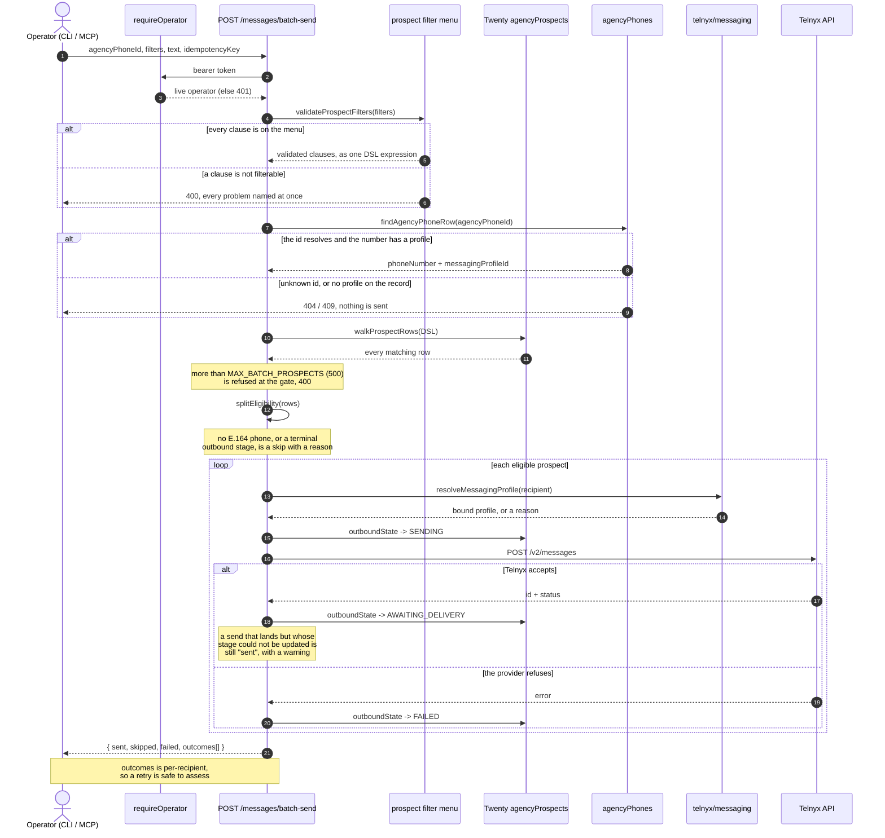

# Prospect batch send

`blaster send` can reach a whole set of prospects in one run instead of one
recipient at a time. This page is the outline: the intent, the two routes it
adds, the properties the route is built to keep, and the exact shape of the
response. The diagram is
[diagrams/prospect-batch-send.mmd](diagrams/prospect-batch-send.mmd).

## What it meant to do

The old send command took a single recipient number and a message, and picked
a sending number by hand. The intent behind the prospect batch is to make the
common path honest and repeatable:

- **The pool is real, not assumed.** Recipients come from the workspace's own
  `agencyProspects` records, filtered by fields the operator can actually see.
  Nobody hand-types a list of numbers into a money-spending command.
- **The sending number is re-resolved by id.** The operator picks a number from
  the workspace's `agencyPhones`, and passes back its record id. The server
  looks that id up again before sending, so a surface can never smuggle a
  number or a messaging profile past the workspace.
- **The profile still comes from the number's own record.** A batch does not
  invent a profile; it inherits the single-send rule that the number's
  `agencyPhones` record is the only authority.
- **Eligibility is decided before anything is sent.** A row with no sendable
  phone, or one already sitting in a terminal lifecycle stage, is skipped with
  a reason, not silently dropped and not forced through Telnyx.
- **Every recipient gets its own outcome.** A batch reports what happened to
  each prospect — sent, skipped with a reason, or failed with the provider's
  words — rather than one fake all-or-nothing number.

## The two routes

<!-- embedded: prospect-batch-send.mmd -->
A batch, in one picture. Filters are definitions; eligibility is decided before anything is sent; every recipient gets an outcome.




Both sit on the gated `inbox` Hono app (mounted at `/api`), so they require a
live operator token, and both read `agencyProspects` through the shared
`twenty/agencyProspect` helpers.

| Route | Purpose |
| --- | --- |
| `GET /api/prospects/fields` | The filterable menu: every `agencyProspects` field worth exposing, its type, its allowed operators, and the human word for each operator |
| `POST /api/prospects/search` | One page of prospects matching a filter definition, with a cursor and a total |
| `POST /api/messages/preview` | What a batch would do: totals, the eligible/skipped split, and a small sample, without sending anything |
| `POST /api/messages/batch-send` | The run itself: send to every eligible prospect matching the filters |

### The filter menu is the source of truth

`GET /api/prospects/fields` answers without calling Twenty: it is the shared
`OPERATORS` registry plus the field menu in `twenty/agencyProspect`, grounded in the
generated `agencyProspects` schema. Each field carries `filterOperators` (the
DSL tokens) and `operatorLabels` (the plain word for each token, in the same
order). A client that shows "equals" instead of "eq" is reading this route, not
inventing its own vocabulary.

`operatorLabels` is **optional** on the wire. A server deployed before that
field existed omits it, and a prompt must fall back to the bare token rather
than assume it is present — the CLI reads `field.operatorLabels?.[i] ?? token`,
so a stale server degrades to the token instead of crashing.

### Filters are definitions, not DSL

`search`, `preview`, and `batch-send` all accept the same `filters` array:
`{ field, operator, value }` clauses. The server runs them through
`validateProspectFilters`, which checks each clause against the menu:

- a field that is not filterable is a 400,
- an operator the field does not allow is a 400,
- a value that cannot be coerced to the field's type (number, boolean, enum,
  string) is a 400.

Every problem is reported at once, so the caller fixes them in a round trip.
Only after validation does the menu render the clauses into a single Twenty
filter DSL expression. This is the boundary the spec asked for: the client
sends definitions and the server queries; the client never submits raw query
DSL, and never fetches a recipient list and uses it as the authority.

### Preview never sends

`/api/messages/preview` walks the matching rows, runs the same eligibility
split, and returns the counts plus up to five sample prospects. It touches
Telnyx and the prospect lifecycle in no way. It is the "what will happen" step
the operator confirms before the real run.

### The batch run

`/api/messages/batch-send` is the only route that spends money and moves
prospect state. In order, it:

1. Validates the body: `agencyPhoneId`, `filters`, non-blank `text`, and an
   `idempotencyKey`.
2. Re-resolves `agencyPhoneId` to an `agencyPhones` row. Unknown id is a 404;
   a row with no `messagingProfileId` is a 409, because Blaster does not fall
   back to a global profile.
3. Walks the matching `agencyProspects` rows and refuses the run outright — a
   400, nothing sent — if the match set is larger than the batch ceiling.
4. Splits the rows into eligible and skipped. Skipped rows become `skipped`
   outcomes with a reason: no sendable E.164 phone, or a terminal outbound
   stage (opted out, paused, replied, qualified, booked, completed).
5. For each eligible prospect, resolves the messaging profile for that
   recipient, advances the prospect's `outboundState` to `SENDING`, sends
   through Telnyx, and on success moves it to `AWAITING_DELIVERY`.

The lifecycle writes are best-effort on purpose. A message that Telnyx
accepted but whose stage update then failed is still reported as `sent`, with a
detail saying the stage could not be updated — the send is the fact, and a
bookkeeping gap is not allowed to mask it. A provider rejection moves the
prospect to `FAILED` and records the provider's words as the detail.

### The response

The batch returns one outcome per recipient and an aggregate, exactly as the
response pins it:

```json
{
  "agencyPhoneId": "rec-us-1",
  "from": "+15557654321",
  "idempotencyKey": "the key the caller sent",
  "total": 41,
  "sent": 39,
  "skipped": 2,
  "failed": 0,
  "outcomes": [
    { "prospectId": "...", "phone": "+1...", "status": "sent", "telnyxId": "..." },
    { "prospectId": "...", "phone": null, "status": "skipped", "detail": "no sendable phone number" }
  ]
}
```

`idempotencyKey` is accepted, required, and echoed back as the run correlator:
an operator matches a run to its outcomes by it. There is no server-side dedup
store, so a retried key re-runs and re-reports; what makes a retry safe to
assess is the per-recipient outcomes, which show exactly who was touched and
by what.

## Where the shape lives

| Concern | File |
| --- | --- |
| Operator registry and field menu | `packages/core/src/twenty/agencyProspect/helpers/prospects.ts` |
| Shared types (`ProspectField`, `ProspectFilter`, `BatchSendResult`, ...) | `packages/core/src/blaster/api/types.ts` |
| Client methods (`listProspectFields`, `searchProspects`, `previewProspectSend`, `sendToProspects`) | `packages/core/src/blaster/api/helpers/client.ts` |
| The four routes | `apps/api/src/index.ts` (the `inbox` app) |
| The guided and scripted CLI paths | `packages/blaster-cli/src/cli/send.ts` |
| Route tests | `apps/api/test/prospects-routes.test.ts` |
| The diagram | `docs/diagrams/prospect-batch-send.mmd` |

## Known edges to keep in mind

- **The deploy must be current.** These routes and the optional `operatorLabels`
  exist only on a build that includes them. A stale deployment answers with a
  404 and the old field shape, which is how a CLI can crash on a missing
  property. After a push, confirm the production alias serves the new routes.
- **The operator label is a display concern only.** The wire contract is the
  token; the label is a convenience for a prompt and is safe to omit.
- **Eligibility is a coarse rule today.** "No sendable phone" and "terminal
  lifecycle stage" are the two skip reasons. Adding a reason is a change to
  the `SKIP_OUTBOUND_STATE` map, and it flows into preview and batch together.
- **One route owns a write.** The batch send is the only place that advances
  `outboundState` on a prospect. The single-send route does not, so the two
  paths keep different lifecycle behavior on purpose.
