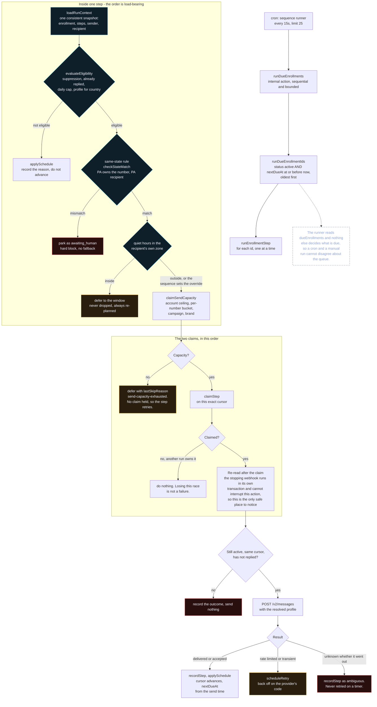
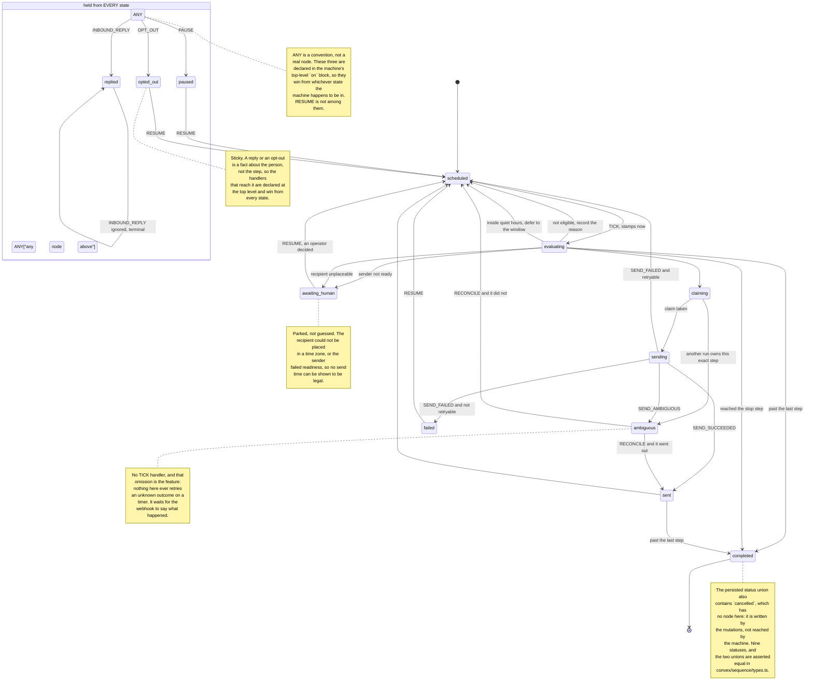

# The sequencer

Multi-step outbound SMS: a sequence of messages to a prospect, each after a
delay, stopping the moment they answer.

**This page says what is finished and what is not, because the not part is
load-bearing.** A sequencer that is half-wired and documented as if it were whole
is worse than one that is absent: an operator reads the docs, believes messages
are going out, and discovers otherwise from a prospect.

## What works today

<!-- embedded: sequence-runner-tick.mmd -->
One tick of the runner. The ordering in the middle is the load-bearing part: capacity is claimed before the step is, because a step claim is permanent.




| Piece | Where | State |
| --- | --- | --- |
| Draft shape, validation, eligibility rules | `pipeline/sequence/helpers/builder.ts` | done, tested |
| **Enrollment statechart** | `pipeline/sequence/machine.ts` | done, 23 tests |
| **Quiet hours** | `pipeline/sequence/helpers/quiet-hours.ts` | done, tested |
| Dry run of the real statechart | `pipeline/sequence/helpers/dry-run.ts` | done, tested |
| Draft storage, and the CLI that edits it | `blaster sequence` | done, 17 tests |
| Persistence | `convex/sequence/` | tables and functions exist |
| **The runner** | `convex/sequence/actions.ts` | scheduled by `convex/crons.ts`; selects its sender from a pool when one is assigned |

## The exact crack, and what closed it

The three blockers named below have been closed on `jilly-pool-domain`:

1. **The schema now accepts the machine's statuses.** `ambiguous` and
   `awaiting-human` are persisted by the runner's deferral paths.
2. **The claims table exists.** `sequenceSendClaims` has a unique index on
   `[enrollmentId, cursor]`, and the internal `claimStep` mutation is the only
   door into it.
3. **`convex.json` and `convex/crons.ts` exist.** A one-minute cron drains
   `runDueEnrollments` with a batch of 25; `docs/pools.md` and
   `goal.md` track the state.

## What remains open: deployment

The branch has been merged to `main` (PR #2, `9b70ac3`). What is not yet done is
the live-deployment step: `pnpm convex:deploy`, watching the one-minute cron fire,
and `pnpm openapi` against the prod deployment to regenerate the spec. The test
harness in `convex/test/` proves the Convex layer; that is the last gap.

## A reply stops the sequence, and tells a human

Done. A verified inbound message stops every active enrollment for that peer
**in the same Convex transaction that stores the message**, so the two facts
cannot disagree: a reply that is stored but does not stop the sequence keeps
texting someone who answered.

```text
Telnyx webhook (Ed25519 verified)
  -> recordInboundMessage
       -> dedupe on providerEventId   <- returns here on a redelivery
       -> store the message
       -> stopEnrollmentsForPeer     <- same transaction
  -> broadcastReply                  <- fire and forget, never fails the request
```

The dedupe is the load-bearing part and it is *already there*: a Telnyx
redelivery returns from the `providerEventId` check before it reaches the stop or
the fan-out, so a redelivered reply can neither stop an enrollment twice nor
notify a human twice. That is why the caller is told what stopped rather than the
notifier deciding whether it has seen a message before.

The push is the pattern from the dialer's new-lead broadcast, ported:

| Property | Why |
| --- | --- |
| One fan-out point per event | More than one path can reach the same event, and they have to agree |
| Notification never fails the event | A stored reply that stopped a sequence is worth more than the push; Telnyx retries a 500 three times |
| A member with no `BARK_KEY` is skipped, not failed | Not everyone configured one, and that is a configuration state |
| The device key is redacted everywhere | It is a credential for that member's device |
| `level: timeSensitive` | A reply is the moment a human is waiting on it |

`barkKey` is read from the Twenty `workspaceMember`, so a push goes to the person
rather than to a shared channel. It arrives as a `RICH_TEXT` field — `{ blocknote,
markdown }` over REST, a bare string when typed by hand — so it is extracted from
the markdown and trimmed, because rich-text editing routinely leaves a trailing
newline that would make every push fail against an otherwise correct key.

The response reports `stoppedEnrollments`, so the stop is observable without
reading the database.

## The two design decisions worth knowing before you extend it

<!-- embedded: enrollment-state-machine.mmd -->
The state machine itself. Three states need reading twice — `ambiguous`, `awaiting_human` and `opted_out`.




### A send is claimed before it is attempted

`convex/sequence/mutations.ts` has a comment claiming that recording the step transition in
one place "makes the sequence resumable after a failure without double-sending".
**That is backwards.** It is called *after* the send, so a crash or a timeout
between the two is precisely a double send. This is the dominant cause of
duplicate messaging in practice, not the provider sending twice: a read timeout
after the request was sent leaves you not knowing whether it was accepted, and
billing fires at submission rather than delivery.

The fix is why `claiming` is a state rather than a step inside `sending`: the
runner cannot reach a send without having presented a key to a store with a
uniqueness constraint. The key is `enrollmentId:cursor`, derived rather than
generated, so a retry of the same step collides by construction instead of by
luck. [Reference](https://www.smsgatewaycenter.com/blog/message-idempotency-preventing-duplicate-sends/).

### An ambiguous send never retries itself

`ambiguous` has **no `TICK` handler at all**. It is reached when a send's outcome
is unknown, and also when a second worker loses the claim race — a worker that
finds the key already claimed also does not know whether that send went out. The
only way out is `RECONCILE`, which is a decision about a fact the machine cannot
observe. Omitting that handler is the feature, and there is a test that ticks an
ambiguous enrollment and asserts nothing moves.

## Sending through a number pool

A sequence may send from a fixed `fromNumber`, or from a pool of numbers
(assigned with `blaster pools assign --sequence <id> --pool <id>`; see
[pools.md](pools.md)). A pool sequence takes its number from the pool per send,
in pool order and inside each number's rate budget.

The runner honours the budget rather than the carrier's limit queue: before
claiming a step it reads the pool, and when no number may send now it defers the
enrollment to the instant the pool is next able to send
(`lastSkipReason: "pool-rate-limited"`). A pool with no active numbers parks the
enrollment `awaiting-human` (`lastSkipReason: "pool-empty"`) instead of retrying
forever. The number's budget is spent by an internal `consumeSender` mutation
only once the limiter has granted capacity, and the step is claimed last, so a
deferred or lost step never costs a number an allowance. A sequence with no pool
is unchanged and uses its fixed `fromNumber`.

The pool is the selection authority; the send rate limiter in
`convex/rateLimit.ts` stays the admission control. The runner claims limiter
capacity for the pool-chosen number immediately before the Telnyx call and defers
when it refuses, so the pool's `minSpacingMs` (defaulted to the limiter's
per-number period) paces the pool without outrunning the account ceiling. See
[pools.md](pools.md), "The pool and the send rate limiter".

## Quiet hours

Marketing texts may not be sent outside **08:00–21:00 in the recipient's local
time** (47 CFR 64.1200(c)(1)) — not the sender's, not the server's. A 9:30pm
Eastern send is already past quiet hours for an East-Coast recipient while it is
6:30pm on the West Coast. Since November 2024 a wave of class actions has alleged
violations **even where the recipient consented**, and the industry's FCC petition
arguing written consent forecloses the claim is still unresolved, so consent is
not a usable defence and the window is enforced unconditionally.
[Reference](https://a2p.guide/texting/compliance/quiet-hours/).

Two consequences the code takes:

- A step that comes due in quiet hours is **pushed to the next allowed instant,
  not dropped**, so a sequence enrolled at 11pm still completes.
- A recipient that **cannot be placed** in a time zone is parked as
  `awaiting-human` rather than guessed at, because inventing a timestamp is what
  produces the 3am send in the first place. The zone comes from the area code via
  the table `derivePhoneState` already backs; states that straddle zones are
  flagged `approximate` so a caller can bias conservative.

## Using it

```bash
blaster sequence new                     # build a draft interactively
blaster sequence list                    # what is recorded
blaster sequence show "Spring outreach"  # the steps, plus a plan
blaster sequence run   "Spring outreach"  # dry run; says what is not wired
blaster sequence edit  "Spring outreach"  # change the first message
blaster sequence rm    "Spring outreach"
```

Add `--recipients` to any read-only action for a per-recipient plan:

```bash
blaster sequence show "Spring outreach" \
  --recipients '[{"id":"1","to":"+15557654321","stateCode":"NY"}]'
```

The plan is computed by running the **real statechart**, not by a second
implementation of its rules, so a plan printed here is the plan the runner would
compute. `stateCode` is optional but is what makes the quiet-hours column
meaningful; without it a US number cannot be placed and the row is reported as
unplaceable.

Drafts live directly in Convex in the `sequenceDrafts` table. They are
resumable working material across sessions until committed into runnable sequences.

## Finishing it, in order

Each step is independently shippable, and each is small.

1. ~~**Add `ambiguous` and `awaiting-human`**~~ **Done.**
2. ~~**Add `sequenceSendClaims`**~~ **Done**, with the internal `claimStep` mutation.
3. ~~**Add `convex.json` and `crons.ts`**~~ **Done.** The one-minute cron drains
   `runDueEnrollments` with a batch of 25.
 4. ~~**Stop the sequence on reply.**~~ **Done.** The verified webhook stores the
    message and stops the enrollment in one transaction, then fans out a Bark
    push. See above. A `STOP` keyword now marks the enrollment `opted-out` and
    writes the durable per-peer `suppressions` row in the same transaction, so a
    later enrollment from another number or sequence is refused at enroll and at
    send.
  5. ~~**Enrol over `agencyProspects`**~~ **Done.** `enrollRecipients` walks
     `agencyProspects` with the send filter DSL and mirrors `outboundState` back,
     exposed on all three surfaces.

## Not legal advice

The quiet-hours rule and the case law above are summarised for engineering
purposes. Verify against the regulation and current litigation before relying on
any of it.
